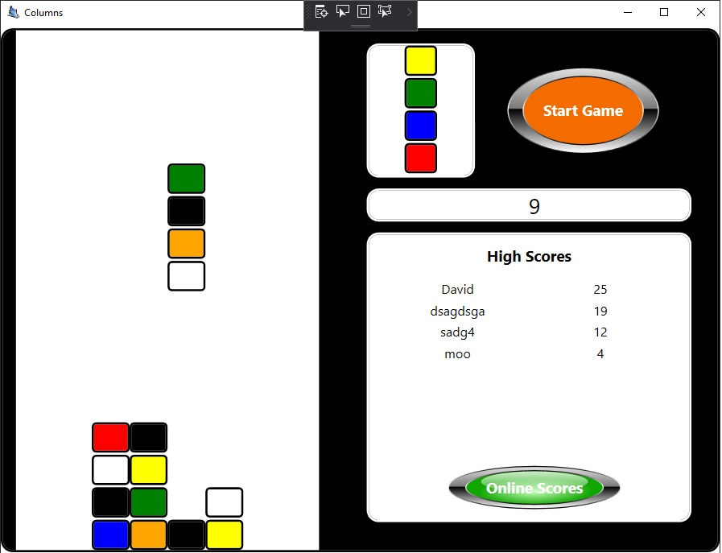

# Summary

This was written by me years ago one Christmas when my dad was complaining that he couldn't play the old "Columns" game he played on our Acorn A3000 computer in the early 90s.

Since I was bored and visiting the parents, and I needed to learn WPF, I decided to try and replicate the game he played as best I could using this "new" technology.

It was a 2 day project and I discovered (as I suspected) that WPF was entirely inappropriate for making games and that attempting good MVVM was relatively futile given the game interaction. I decided to stop fighting it and just finished it off as best as I could without using best practices.

Good news: it works & is stable. My dad played this for years, loving it & no longer pining for his A3000. His score was completely ridiculous and unbeatable, to the point where I thought my sister was hacking the scoreboard. I had to sit and watch him play one day for proof it was really him!

## Note:
* Loads of things could be improved on this. I know. Its hacked together code learning how WPF worked, more than anything else.
* Scorebaord/online scoreboard is trivially hackable.
* The server side of the online scoreboard is offline now anyway.
* Before upload I converted the project from a very old VS project to 2019, and lost some stuff along the way (like the installer).

